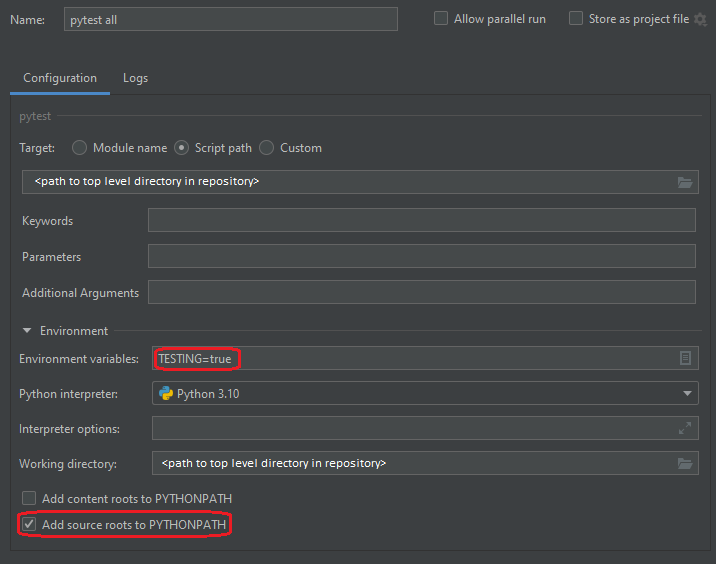

# Idoven back-end challenge
Resolved by Iñaki Martín Soroa

## Description
The challenge description can be found here: https://github.com/idoven/backend-challenge

## Notes to run
The API has been developed with FastAPI.
It requires a mongoDB database (it can be configured with a default user "admin" with password "password" by running
`other/mongosetup.py`), or it can use a volatile database if the environment variable `TESTING=true`.
The volatile database starts with users `"admin":"password"` and `"user1":"password"`

The project can be run from the top level of the repository as: ` py -m uvicorn --app-dir=src main:app --reload`

This project includes unittests.
If you are using PyCharm as your IDE, you can easily run them with the following config:

TESTING=true tells your config file to use the testing volatile database, to avoid polluting the real database

## Improvement areas
* Currently, the ECG processing is very simple and doesn't add any overhead.
  But in a real scenario it can become a bottleneck.
  Given more time I would implement the processing in a separate program which takes work items from a queue.
  That option allows us to easily scale the system to use multiple threads/machines/clouds as long as the queue is accesible.
  One option can be a simple Redis queue or even with MongoDB.
  It would be useful to add a mechanism to report the processing status of different ECGs
* Unittests are incredibly sluggish because hashing functions are involved in every authenticated request.
  This could be improved through mocking the authentication part when it is not tested directly
* Deployment of the solution needs more attention.
  The current code works, but it cannot be easily deployed in other environments.
  Given more time, I would containerize it and prepare a small docker compose or kubernetes script to deploy the
  API, DB, and potentially the workers with multiple replicas.

## Other ideas
* Based on the assignment description, I assumed that the users provide unique IDs for their ECGs.
  And these IDs are also unique across multiple users.
  I doubt this would hold true in a real life environment, so the current implementation in MongoDB which assumes that
  only 1 record exists with a given ID and overwrites existing documents if the ID is repeated, could be a problem.
  There are multiple solutions to this problem, 2 of them are the following:
  * If we assume there is uniqueness within the same user: Store multiple items with the same id.
    Then retrieve documents matching the id and user.
  * We can assign a new UUID internally and report that number back to the user when they submit data.
    The user then need to use this UUID to retrieve their data.
    It is a bit more cumbersome, but it helps with the next point
* Groups support.
  Hospitals work with teams of doctors, so it makes sense that some results are available for other users.
  These groups can be the doctors attending a specific patient, a department, etc.
  Then it would not be that easy to identify the correct record if 2 users used the same id,
  because the requester might have access to both instead of only the ones they submitted.